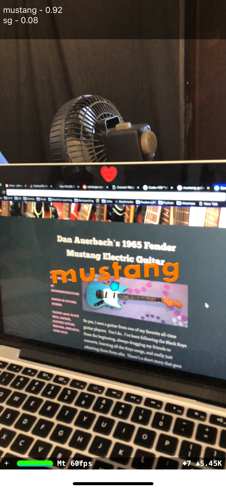

# Guitar-Classifier

Machine Learning for Guitars - this is an elaboration on tensorflow for poets 

# Tensorflow 

```pip install virtualenv```

```virtualenv env```

```
source env/bin/activate
pip install -tensorflow
pip install -pillow
pip install -tfcoreml
```

```IMAGE_SIZE=224```
```ARCHITECTURE="mobilenet_0.50_${IMAGE_SIZE}"```

## Download images 

I used
https://github.com/hardikvasa/google-images-download CLI

## Resize Images

change the paths in resize.py

```cd scripts```
```python resize.py```

## Retrain Model on your images

```
python -m scripts.retrain \
  --bottleneck_dir=tf_files/bottlenecks \
  --how_many_training_steps=500 \
  --model_dir=tf_files/models/ \
  --summaries_dir=tf_files/training_summaries/"${ARCHITECTURE}" \
  --output_graph=tf_files/retrained_graph.pb \
  --output_labels=tf_files/retrained_labels.txt \
  --architecture="${ARCHITECTURE}" \
  --image_dir=tf_files/Guitars
```

## Test tensorflow model
```
python -m scripts.label_image \
    --graph=tf_files/retrained_graph.pb  \
    --image=../Desktop/sg.jpg
```

 ```tensorboard --logdir tf_files/training_summaries &```

# Conversion to CoreML
 
```cd scripts```

Change all paths to where you want to read/write your model and test your images.
 
## Test conversion
 
```python labelcoreml.py```

## Convert model

 ```python converter.py```

From Core ML in ArKit, my fork from the presentation will be up soon.
https://github.com/hanleyweng/CoreML-in-ARKit


